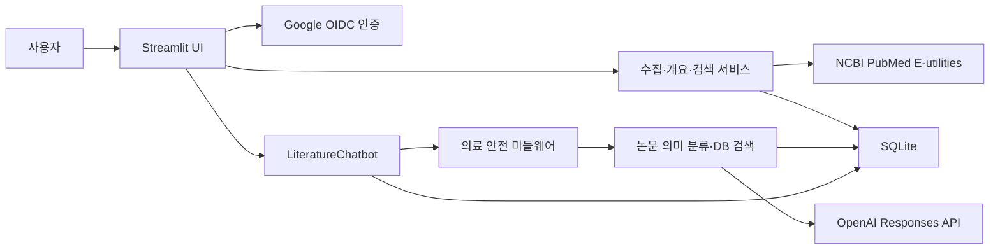
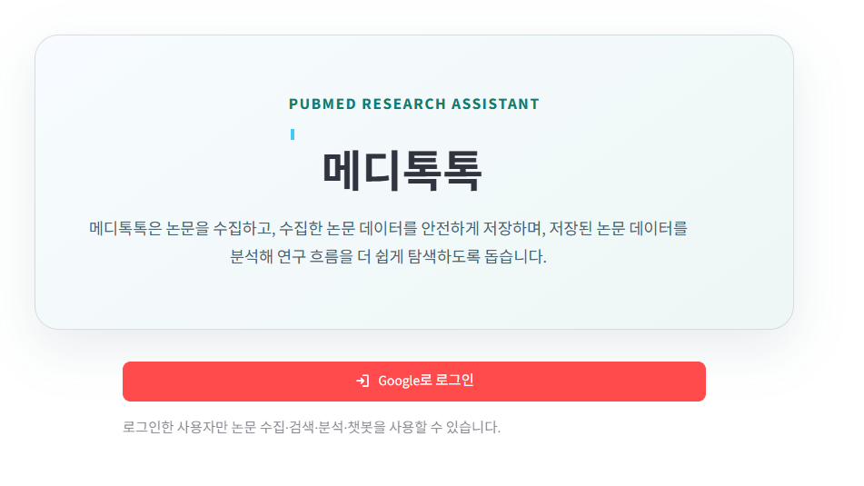
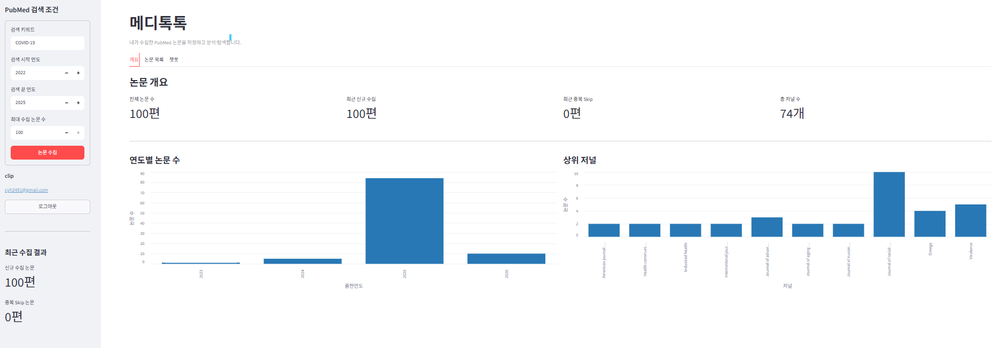
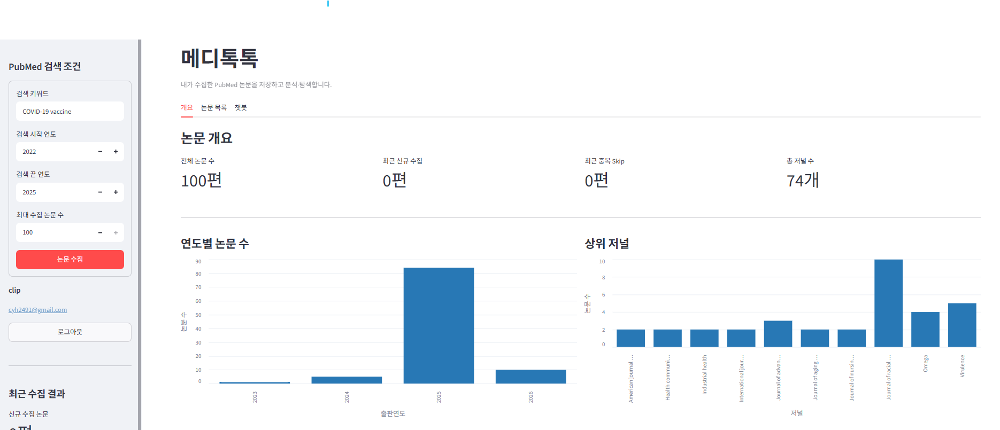
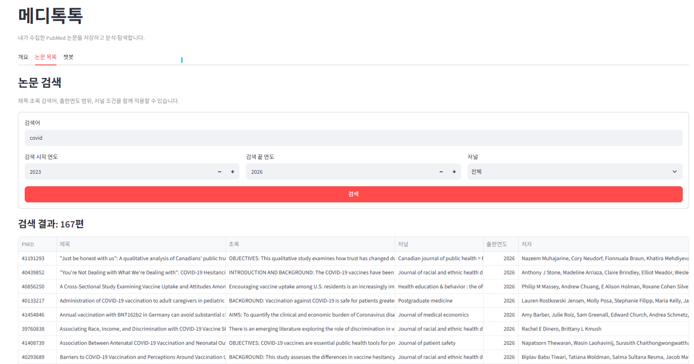
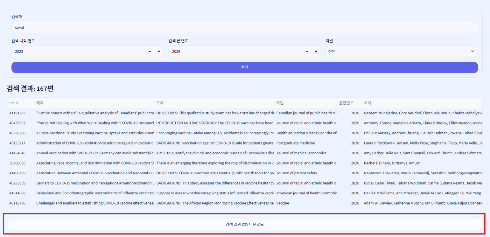
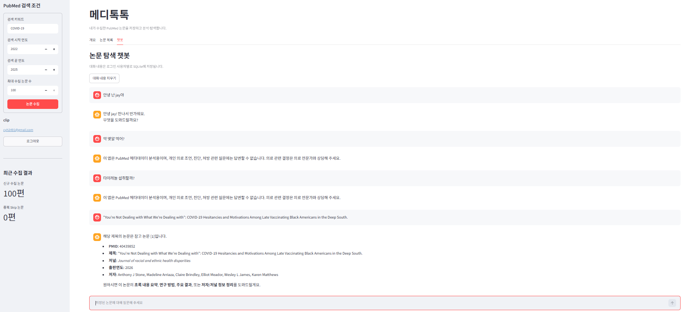

# 메디톡톡

> PubMed API 기반 논문 데이터 수집·분석 및 AI 챗봇 웹 애플리케이션

메디톡톡은 사용자가 지정한 키워드와 출판연도 조건으로 PubMed 논문을 수집하고,
논문 메타데이터를 사용자별로 저장·검색·분석할 수 있도록 만든 Streamlit
애플리케이션입니다. 저장한 논문은 CSV로 내려받을 수 있으며, 논문 문맥을 활용하는
OpenAI 챗봇과 개인 의료 조언을 차단하는 안전 미들웨어를 제공합니다.

## 배포 url
- https://pubmed-webapp.streamlit.app/

## 주요 기능

- Google OIDC 로그인 및 사용자별 데이터 분리
- 검색 키워드, 시작·끝 연도, 최대 수집 수를 이용한 PubMed 논문 수집
- PMID, 제목, 초록, 저널, 출판연도, 저자 메타데이터 저장
- PMID 기본 키와 `INSERT OR IGNORE`를 이용한 중복 저장 방지
- 전체 논문·신규 수집·중복 건너뜀·저널 수 요약
- 연도별 논문 추이와 상위 저널 시각화
- 제목·초록, 출판연도, 저널 조건을 결합한 논문 검색
- 필터 검색 결과 CSV 다운로드
- 사용자별 SQLite 대화 메모리와 OpenAI 스트리밍 챗봇
- 논문 관련 질문의 의미 분류와 저장 논문 문맥 결합
- 개인 의료 조언·진단·처방 질문을 차단하는 이중 미들웨어
- Soft Glass Research 기반 반응형 UI

## 시스템 구성



## 최종 산출물 폴더 구조

```text
PubMed-WebApp/
├── .streamlit/
│   ├── config.toml                 # Streamlit 색상·테마 설정
│   ├── secrets.toml.example        # Google OIDC 설정 예시(placeholder만 저장)
│   └── secrets.toml                # 실제 OAuth 비밀값, Git 제외
├── assets/
│   └── soft_glass.css              # Soft Glass 전역 디자인
├── data/                            # 실행 중 SQLite DB 생성, Git 제외
├── docs/
│   └── images/                      # README 구현 결과 캡처
├── pubmed_app/
│   ├── domain/
│   │   └── models.py               # 분석·검색 도메인 모델
│   ├── repositories/
│   │   ├── article_repository.py
│   │   └── sqlite_article_repository.py
│   ├── services/
│   │   ├── article_search_service.py
│   │   └── overview_service.py
│   ├── ui/
│   │   ├── article_search_page.py
│   │   ├── collection_snapshot.py
│   │   ├── overview_page.py
│   │   └── theme.py
│   ├── auth.py                     # Google OIDC 로그인·사용자 식별
│   ├── chatbot.py                  # 의미 분류·논문 검색·OpenAI 호출
│   ├── chat_memory.py              # 사용자별 SQLite 대화 메모리
│   ├── config.py                   # 환경 변수 기반 앱 설정
│   ├── medical_middleware.py       # 의료 질문 차단 미들웨어
│   ├── paper_search.py             # 챗봇용 논문 검색·CSV 변환
│   └── views.py                    # 챗봇 Streamlit 화면
├── tests/                           # 수집·DB·검색·인증·챗봇·미들웨어 테스트
├── app.py                           # 애플리케이션 조립 및 진입점
├── collection_service.py            # PubMed 수집 유스케이스
├── database.py                      # 수집·사용자 SQLite 저장소
├── models.py                        # 수집 조건과 논문 모델
├── pubmed_client.py                 # PubMed E-utilities 및 XML 파싱
├── requirements.txt
└── README.md
```

## 기술 스택

| 구분 | 기술 | 사용 목적 |
|---|---|---|
| Language | Python | 애플리케이션·수집·분석 로직 |
| Package manager | uv | 가상환경, 의존성 설치, 실행 및 테스트 |
| Web UI | Streamlit 1.60 | 사이드바, 대시보드, 검색, 챗봇 UI |
| UI Design | CSS, Streamlit Theme | Soft Glass Research 디자인과 반응형 화면 |
| Data | pandas, Altair | 검색 결과 테이블과 통계 시각화 |
| Literature API | NCBI PubMed E-utilities | PMID 검색 및 논문 XML 메타데이터 조회 |
| Database | SQLite | 논문, 사용자 연결, 챗봇 대화 상태 저장 |
| Authentication | Google OIDC, Authlib | Google 로그인과 사용자 식별 |
| LLM | OpenAI Responses API, `gpt-5.4-mini` | 입력 의미 분류와 챗봇 답변 생성 |
| Agent/Middleware | LangChain, LangGraph | 모델 호출·스트리밍·의료 안전 미들웨어 |
| Configuration | python-dotenv, `st.secrets` | OpenAI 키와 OAuth 설정 분리 |
| Test | pytest | 저장소, 서비스, 인증, 챗봇 동작 검증 |

전체 버전은 [`requirements.txt`](requirements.txt)에 고정되어 있습니다.

## 팀 구성 및 역할

아래 역할은 저장소의 브랜치·커밋 기록을 기준으로 정리했습니다.

| 팀원 | 담당 영역 | 주요 구현 |
|---|---|---|
| EnochSB | 요구사항 3·4, 프로젝트 기반 | 프로젝트 초기화, 개요 집계·차트, 논문 검색, 검색 오류 수정 및 통합 |
| lcy0330-sketch | 요구사항 5·6, 인증 | 챗봇·CSV 기능 초기 구현, Google OAuth 로그인 및 브랜치 통합 |
| cyh2491 / Choi Young Hyun | 요구사항 1·2·7, 고도화·UI | PubMed 수집 구조의 객체지향화, 의료 미들웨어, 논문 의미 분류, 답변 스트리밍, Soft Glass UI 및 최종 통합 |

## 구현 시 고려한 사항

### 1. 기능별 책임 분리

`app.py`에는 객체 생성과 화면 조립만 두고, PubMed 통신·저장소·서비스·UI·챗봇을
각 모듈로 분리했습니다. 외부 API나 DB 구현을 교체하더라도 화면 코드 전체를
수정하지 않도록 서비스와 저장소 계층을 구분했습니다.

### 2. 중복 논문과 다중 사용자 데이터

논문 원본은 PMID를 기본 키로 저장해 중복을 막고, `user_articles` 연결 테이블을
통해 동일한 논문을 여러 사용자가 각자의 수집 목록으로 사용할 수 있게 했습니다.
개요·검색·CSV·챗봇은 로그인 사용자의 연결 데이터만 조회합니다.

### 3. PubMed XML의 불규칙성

논문마다 초록, 전자 출판일, 인쇄 출판일, 저자 또는 단체 저자 정보가 다를 수
있습니다. 누락 필드를 허용하고 여러 출판연도 후보와 저자 형식을 정규화하여 한
테이블에 저장하도록 처리했습니다.

### 4. 챗봇 라우팅과 논문 문맥

사용자 입력을 단순 키워드만으로 판정하지 않고 LLM이 문맥과 의미를 분석해 논문
관련 여부를 구조화된 Boolean 결과로 반환하도록 했습니다. 논문 질문이면 DB를
검색해 제목·초록·저널·출판연도·저자를 문맥으로 제공하고, 검색 결과가 없으면
임의 답변 대신 미검색 안내를 반환합니다.

### 5. 개인 의료 질문 안전성

Node-style `before_agent`에서는 주요 의료 키워드를 빠르게 검사하고, Wrap-style
`wrap_model_call`에서는 최신 사용자 입력의 의미를 `BLOCK/ALLOW`로 분류합니다.
두 단계 중 하나라도 개인 의료 조언·진단·처방 의도로 판정하면 모델 답변 대신
고정 안내 문구를 반환합니다.

### 6. Streamlit 재실행과 스트리밍 UX

Streamlit은 위젯 상호작용마다 스크립트를 다시 실행합니다. 사용자 메시지를 먼저
대화 컨테이너에 표시하고, AI 응답 전에는 로딩 이미지를 보여 준 뒤 Responses API
출력을 `st.write_stream()`으로 전달했습니다. 대화 컨테이너를 입력창보다 먼저
선언해 새 메시지가 생겨도 입력창이 항상 화면 아래에 유지되도록 했습니다.

### 7. 비밀값 관리

OpenAI API 키는 `.env`, Google OAuth 값은 `.streamlit/secrets.toml`에 저장하며 두
파일 모두 Git에서 제외합니다. `secrets.toml.example`에는 실제 Client ID나 Secret을
넣지 않고 placeholder만 제공합니다.

## 구현 과정에서 어려웠던 점

| 어려움 | 해결 방법 |
|---|---|
| PubMed 논문별 XML 구조와 날짜·저자 필드 차이 | 누락값 허용, 복수 경로 탐색, 문자열 정규화로 파서 안정화 |
| 같은 PMID의 반복 수집 | PMID PK와 `INSERT OR IGNORE`를 함께 사용하고 신규·중복 건수를 별도 계산 |
| 여러 사용자의 논문·대화가 섞이는 문제 | Google `issuer + sub` 사용자 키와 사용자별 연결·대화 테이블 사용 |
| 논문 제목만 입력한 질문의 검색 실패 | LLM 의미 분류 후 원문 제목과 추출 검색어를 함께 사용 |
| 의료 질문의 우회 표현 | 키워드 1차 차단과 모델 기반 의미 차단을 결합 |
| 응답 대기 중 화면이 멈춘 것처럼 보이는 문제 | 사용자 메시지 즉시 렌더링, AI 로딩 표시, 토큰 스트리밍 적용 |
| Streamlit rerun 후 탭·검색 결과·대화 상태 손실 | `st.session_state`와 SQLite 영속 메모리 사용 |
| OAuth 로컬·배포 주소 불일치와 비밀값 노출 위험 | `/oauth2callback` URI를 환경별 등록하고 실제 Secrets를 Git에서 제외 |
| 디자인과 데이터 가독성의 균형 | 투명도는 배경·카드에만 적용하고 표와 차트는 높은 불투명도로 유지 |

## 구현 결과

### Google 로그인

Google 계정으로 로그인한 사용자만 논문 수집·검색·분석·챗봇 기능에 접근합니다.



### 홈 화면 및 논문 개요

전체 논문 수, 최근 신규 수집, 중복 건너뜀, 전체 저널 수와 연구 동향을 확인합니다.



### PubMed 논문 데이터 수집

키워드, 검색연도 범위, 최대 100편의 수집 수를 입력해 PubMed 메타데이터를
사용자 저장소에 수집합니다.



### 논문 검색

제목·초록 검색어, 출판연도 범위와 저널을 조합해 저장된 논문을 필터링합니다.



### CSV 다운로드

검색된 논문의 PMID, 제목, 초록, 저널, 출판연도와 저자를 CSV로 내려받습니다.



### 챗봇 및 의료 안전 미들웨어

저장 논문을 검색해 답변 문맥으로 사용하며 개인 의료 조언·진단·처방 질문에는
고정 안내 문구를 반환합니다.



## 실행 방법

### 1. 가상환경과 패키지 설치

PowerShell:

```powershell
uv venv .venv
.venv\Scripts\Activate.ps1
uv pip install -r requirements.txt
```

Git Bash:

```bash
uv venv .venv
source .venv/Scripts/activate
uv pip install -r requirements.txt
```

### 2. OpenAI API 키 설정

프로젝트 루트의 `.env` 파일에 키를 저장합니다.

```dotenv
OPENAI_API_KEY=발급받은_API_키
```

### 3. Google OAuth 설정

`.streamlit/secrets.toml.example`을 `.streamlit/secrets.toml`로 복사한 뒤 실제 값을
입력합니다.

```toml
[auth]
redirect_uri = "http://localhost:8501/oauth2callback"
cookie_secret = "32자 이상의 무작위 문자열"

[auth.google]
client_id = "Google Client ID"
client_secret = "Google Client Secret"
server_metadata_url = "https://accounts.google.com/.well-known/openid-configuration"
```

Google Cloud Console의 승인된 리디렉션 URI에도 다음 주소를 정확하게 등록합니다.

```text
http://localhost:8501/oauth2callback
```

배포 환경에서는 로컬 주소를 `https://<앱주소>/oauth2callback`으로 변경해야 합니다.

### 4. 애플리케이션 실행

```bash
uv run streamlit run app.py
```

기본 SQLite 경로는 `data/pubmed.db`입니다. 필요하면 환경 변수로 변경할 수 있습니다.

```powershell
$env:PUBMED_DB_PATH="data/pubmed.db"
$env:PUBMED_ARTICLE_TABLE="articles"
$env:PUBMED_TOP_JOURNAL_LIMIT="10"
$env:NCBI_EMAIL="researcher@example.com"
$env:NCBI_API_KEY="선택사항"
uv run streamlit run app.py
```

## 테스트

```bash
uv --cache-dir .uv-cache run python -m pytest -q
```

테스트는 PubMed 파싱, 수집 건수, SQLite 중복 방지, 사용자별 조회, 검색 조건,
Google 사용자 식별, 챗봇 라우팅, 대화 메모리와 의료 미들웨어를 검증합니다.

## 배포 시 참고사항

- Streamlit Community Cloud에서는 로컬 SQLite 파일의 영구 보존이 보장되지
  않습니다. 실제 다중 사용자 서비스에서는 PostgreSQL 같은 외부 DB를 권장합니다.
- Community Cloud의 Secrets 설정에 Google OAuth와 OpenAI 키를 등록하고 실제 비밀
  파일은 저장소에 올리지 않습니다.
- 배포 주소의 `/oauth2callback`을 Google Cloud Console과 Streamlit 설정에 동일하게
  등록해야 합니다.
- CSS는 Streamlit 1.60 DOM을 기준으로 작성했으므로 Streamlit을 업그레이드할 때
  주요 화면의 스타일과 접근성을 다시 확인해야 합니다.
